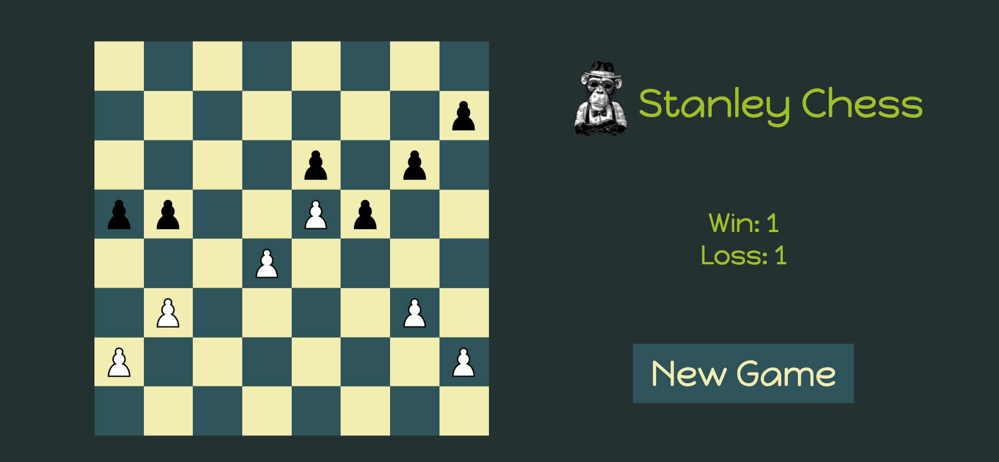
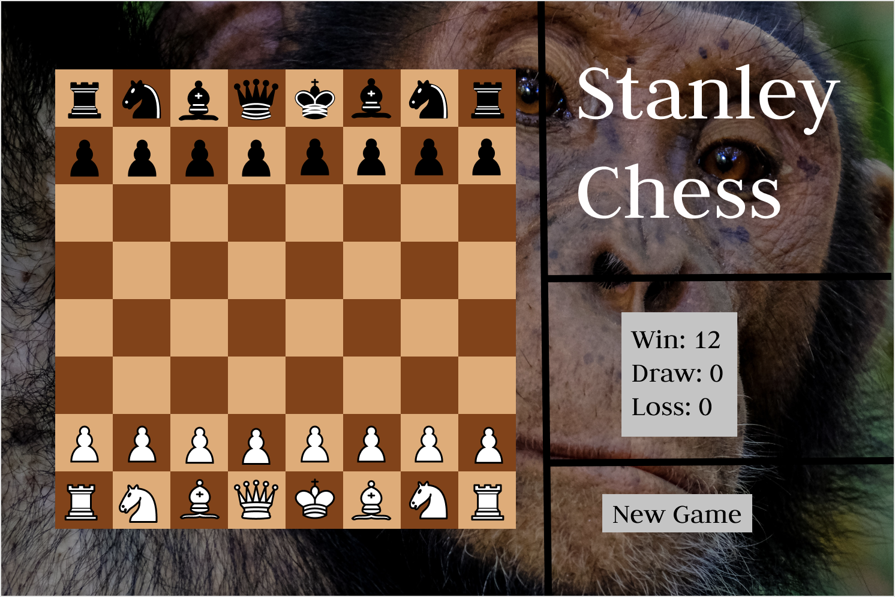

# Stanley Chess

Stanley Chess is a web application inspired by Stanley, a chimpanzee from the *Chessmaster* series of games who was the lowest rated computer opponent and played completely random moves.

Stanley Chess brings this classic character into the modern world. For the initial iteration, users can play against friends in a 'pawn game', a minigame used by junior players in which the goal is to get a pawn to the end of the board. Eventually, users will be able to play against Stanley in full games of chess!

## Technologies Used
* JavaScript
* HTML
* CSS

## Getting Started

[Game](https://acashmoney.github.io/stanley-chess/)

In the pawn game, pawns can move as they normally do with the exception of the en passant rule. Users click an initial square with a pawn to select a pawn to move and click the square they intend to move the pawn to. The game ends when one side has moved a pawn to the end of the board, and the score is logged on the scoreboard.

## Next Steps

The app works as intended for the pawn game. Planned improvements to the app in roughly chronological order are as follows:
1. Very basic AI that plays the pawn game against the user.
2. Add king piece to the game.
    * Rules for pawn promotions
    * Rules for check and checkmate
3. AI (Stanley) that plays a move randomly from the list of available legal moves.
4. Options to play against Stanley or a friend.
5. Add remaining piece types to the game.
6. Advanced rules -- castling and en passant.
7. Animations and sounds to improve the user experience.
